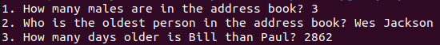

# inPowered task

I developed two projects for this task, one exactly as requested (small application in Java), the second I developed in a robust architecture using Spring and tests in JUnit, just to complement the challenge. Only the first was mandatory to solve the task.

The two projects are explained below:

## 1) Project task-in-small-java-app (the task)
### About the project
The idea of ​​this project was to meet the designed task: "develop a small java application"
The source code is in a single file with pure java, all very simple.

### Minimum requirements to run this project
- Java 8 or any higher version

### How to compile and run
Execute the commands below:
```bash
- cd task-in-small-java-app
- javac InPoweredTest.java
- java Main
```

### Output you should see after run


## 2) Project task-spring-boot-rest-api (optional, just to show more)
This second project is just additional, evaluating it is optional, just to have the possibility to see the same task developed in a more robust Rest API project.

It was developed using Spring, testing (unit and integration) on JUnit, data was migrated using Flyway to a local H2 database.

### Minimum requirements to run this project
- Java 8 or any higher version
- Maven

### Run the automated tests (which are passing)
```bash
mvn test
```

### Run the app (Or you can run in your IDE):
```bash
mvn spring-boot:run
```

### Endpoints

- http://localhost:8080/address-book/count-males
- http://localhost:8080/address-book/person/oldest
- http://localhost:8080/address-book/person/name1/{name1}/name2/{name2}/diff-age-days
- From Spring Boot Actuator: http://localhost:8080/actuator/health

To enter any endpoint you can use curl:
```bash
curl { endpoint url }
```
(or just copy the endpoint url in your browser)
